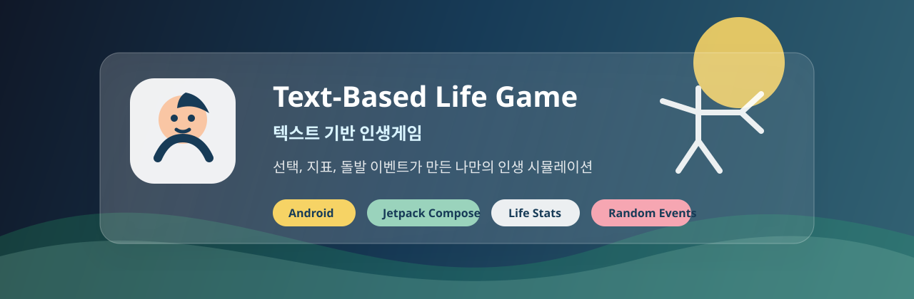

# hansung-lifegame

> 아기 캐릭터로 시작해 선택과 지표, 돌발 이벤트가 만든 미래를 확인하는 Android 기반 텍스트 인생게임입니다.

| 구분 | 내용 |
| --- | --- |
| 교과목 | 고급모바일프로그래밍 |
| 프로젝트 주제 | 텍스트 기반 인생게임 |
| 개발 대상 | Android 모바일 앱 |
| 개발 환경 | Android Studio, Kotlin, Jetpack Compose |
| 핵심 재미 | A/B 선택, 7개 지표 누적, 조건 분기, 특수 돌발 이벤트, 다양한 결말 |
| 팀 이름 | 인생게임 제작 |

사용자는 아기 사진 또는 기본 캐릭터 이미지로 인생을 시작합니다. 각 상황은 텍스트와 이미지로 제시되며, 사용자의 선택은 건강, 운동능력, 지력, 사회성, 경제력, 행복, 운 지표에 반영됩니다. 누적된 선택과 지표는 이후 사건과 결말을 바꿉니다.

## 바로 보기

- [프로젝트 개요](#프로젝트-개요)
- [핵심 기능](#핵심-기능)
- [게임 흐름](#게임-흐름)
- [지표 시스템](#지표-시스템)
- [특수 돌발 이벤트](#특수-돌발-이벤트)
- [개발 역할](#개발-역할)
- [4주차 개발 숙제](#4주차-개발-숙제)
- [기술 스택](#기술-스택)
- [예상 폴더 구조](#예상-폴더-구조)
- [현재 상태](#현재-상태)

## 프로젝트 개요

이 프로젝트는 선택형 텍스트 게임의 흐름에 인생 시뮬레이션 요소를 결합한 Android 앱입니다. 단순히 좋은 선택과 나쁜 선택을 고르는 게임이 아니라, 사용자가 쌓아온 선택과 경험이 이후 사건과 결말에 영향을 주는 구조를 목표로 합니다.

최종 앱은 선택지 약 1,000개 이상, 결말 30개 이상까지 확장할 수 있는 데이터 구조를 지향합니다. 수업 제출 단계에서는 앱 실행, 기본 화면 흐름, 선택 계산, 사건 JSON 연결, 결말 판정을 우선 완성합니다.

## 핵심 기능

| 기능 | 설명 | 상태 |
| --- | --- | --- |
| 캐릭터 설정 | 기본 아기 이미지 또는 사용자 사진으로 인생 시작 | 설계 |
| 상황 표시 | 성장 단계별 상황 텍스트와 이미지 표시 | 설계 |
| A/B 선택 | 선택지에 따라 지표와 경험 플래그 변경 | 설계 |
| 7개 지표 | 건강, 운동능력, 지력, 사회성, 경제력, 행복, 운 | 설계 |
| 조건 분기 | 지표와 경험에 따라 다음 사건 결정 | 설계 |
| 특수 돌발 이벤트 | 낮은 확률로 과장되고 어이없는 위기 상황 발생 | 설계 |
| 결말 판정 | 누적 지표와 선택 이력으로 인생 결과 제공 | 설계 |
| 저장·이어하기 | 현재 사건, 지표, 선택 이력 저장 | 설계 |
| C 직접 입력 | 사용자가 직접 입력한 행동을 AI가 해석하는 확장 기능 | 선택 기능 |

## 게임 흐름

```text
시작
  → 캐릭터 설정
  → 상황 표시
  → A/B 선택
  → 지표와 경험 반영
  → 다음 사건 또는 돌발 이벤트
  → 최종 결말
  → 다시 시작
```

## 지표 시스템

| 지표 | 의미 |
| --- | --- |
| 건강 | 질병, 수명, 회복력, 위기 상황에서의 생존 가능성 |
| 운동능력 | 신체 활동, 순발력, 스포츠와 위험 회피 능력 |
| 지력 | 학습 능력, 판단력, 시험과 문제 해결 능력 |
| 사회성 | 가족, 친구, 동료와의 관계와 도움 요청 능력 |
| 경제력 | 돈을 벌 기회, 자원 관리, 생활 안정성 |
| 행복 | 만족감과 정서적 여유 |
| 운 | 예상 밖의 기회, 돌발 이벤트의 피해 완화 가능성 |

## 특수 돌발 이벤트

일반 사건 사이에 낮은 확률로 개복치 게임처럼 과장되고 어이없는 위기 상황이 발생합니다. 돌발 이벤트는 즉시 사망만 제공하지 않고, 선택과 지표에 따라 생존, 부상, 사망 위기, 실제 사망으로 갈라집니다.

예시:

- 낙엽 뒤에 숨어 있던 장수말벌에게 목 근처를 쏘이는 상황
- 자동문이 사용자를 인식하지 못해 등교길에 12번 거절당하는 상황
- 면접장에서 뚜껑이 닫힌 물병을 마시는 척했다는 사실을 깨닫는 상황

## 개발 역할

| 역할 | 담당 범위 |
| --- | --- |
| 팀장: 총괄·기획, QA·문서화 | 일정, 요구사항, 품질 검증, 제출물 관리 |
| 프론트엔드 개발 담당 | Android 화면, 화면 이동, 사용자 입력 처리 |
| UI/UX 디자인 담당 | 화면 배치, 글씨 크기, 버튼, 이미지 영역, 가독성 |
| 백엔드·게임 로직 담당 | 지표 계산, 선택 반영, 사건 분기, 결말 판정 |
| 시나리오·콘텐츠 작성 담당 | 사건 문장, 선택지 문장, 결과 문장, 돌발 이벤트 |
| DB·콘텐츠 데이터 담당 | 사건, 선택지, 결말, 이미지 ID, 저장 상태 구조 |

## 4주차 개발 숙제

4주차부터는 문서만 작성하지 않고, 커밋 가능한 Android 개발 단위로 작업합니다.

| 역할 | 이번 주 산출물 |
| --- | --- |
| 프론트엔드 개발 담당 | Android 프로젝트 뼈대, `MainActivity.kt`, 화면 5개 |
| UI/UX 디자인 담당 | Compose 테마, 공통 UI 컴포넌트 4개 이상 |
| 백엔드·게임 로직 담당 | `GameModels.kt`, `GameEngine.kt`, `GameEngineTest.kt` |
| 시나리오·콘텐츠 작성 담당 | `events.sample.json` 사건 80개 이상 |
| DB·콘텐츠 데이터 담당 | 결말 20개 이상, 이미지 ID 80개 이상, Repository와 ProgressStore |
| 팀장 | 테스트 30개 이상, 변경 전후 비교표, 8주 범위표 |

자세한 내용은 [4주차_팀원_개발숙제.md](4주차_팀원_개발숙제.md)를 기준으로 진행합니다.

## 기술 스택

| 영역 | 기술 |
| --- | --- |
| 언어 | Kotlin |
| UI | Jetpack Compose, Material3 |
| 화면 이동 | Navigation Compose |
| 상태 관리 | ViewModel, Compose State |
| 데이터 | JSON assets, 추후 Room 또는 DataStore 검토 |
| 비동기 처리 | Kotlin Coroutines |
| AI 확장 | 선택적 C 입력 기능 구현 시 중계 서버 또는 API 연동 검토 |

## 예상 폴더 구조

```text
hansung-lifegame/
├── app/
│   └── src/main/
│       ├── assets/
│       │   ├── events.sample.json
│       │   ├── endings.sample.json
│       │   └── image_ids.sample.json
│       └── java/com/example/lifegame/
│           ├── data/
│           ├── domain/
│           └── ui/
├── assets/
│   └── github/
├── docs/
│   └── qa/
├── README.md
├── 명세서.md
├── 텍스트_기반_인생게임_프로젝트_초안.md
└── 4주차_팀원_개발숙제.md
```

## 현재 상태

- 프로젝트 주제와 팀 구성 확정
- 개발 명세서 작성
- 역할 후보 정리
- 4주차 개발 숙제 작성
- GitHub README와 배너 준비
- Android 앱 코드는 4주차 개발 숙제부터 구현 예정

